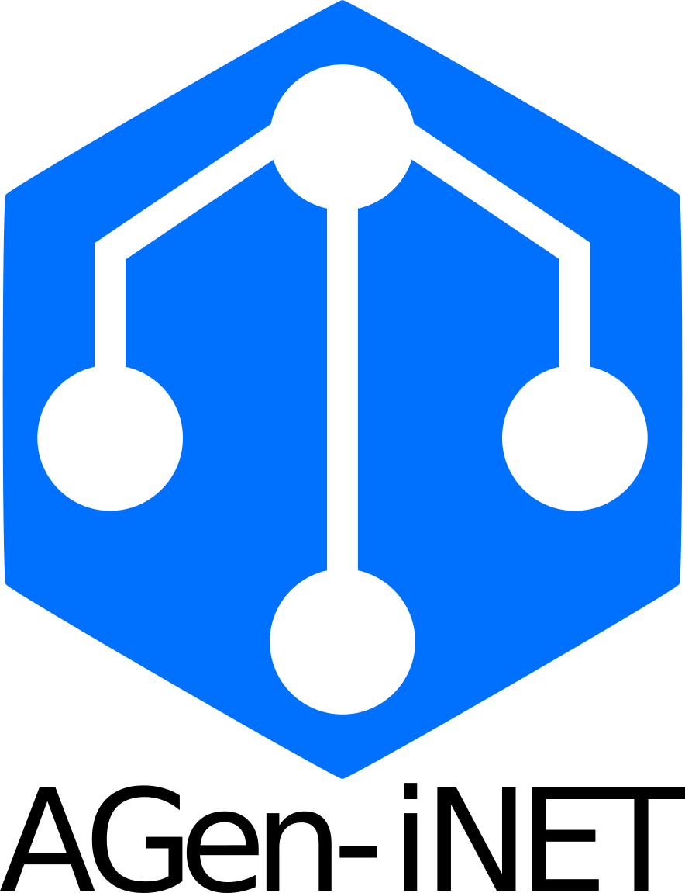

# Longhack2023: AGen-iNET

  

## GitHub repo of Longhack project

The idea is to develop an end-to-end platform to analyse sequencing data and retrive biological meaningful information.

The novelty reside in:
- First **REAL** end-to-end analysis platform (no code required, no secondary analysis, no pre-processing)
- Novel algorithm that integrate diffentially expressed genes, expression, mutational profile to priori knowledge of aging and selected diseases
- The results can be directly used to identify biomarkers and potential drug targets
- Ensure confidentiality and privacy protection mantaining all the intermediate files inside the containers and crypting the results

The project is devided in 3 sub-teams:
- Front-end developmnet with a focus on the user to create an accessible GUI
- back-end development:
  - pipeline development: building a robust pipeline for the analysis of sequencing data to ensure reproducibility, stability and speed of the analysis
  - network analysis: development of novel algorithms for the network analysis, for our knowlede is the first algorithm that integrate meaningfully 
 several layer of informations for the sequencing data to priori knowledge of two conditions (Diseaee|Aging). The results aren't simply data-driven, 
 but projected on the up-todate biological/clinical knowledge.

The core idea is to develop a **new service/software** that can be **selled to several realities** that cannot afford a team of expert bioinformaticians, some ideas are:
- **Clinicians**: hospital often lack of bioinformatics expert and our service can help to guide clinicians to personalise therapies for the patients and to 
evaluate off-label prescription from a in-depth analysis
- **Pharma companies**: medium/small companies needing for the analysis of sequencing data, prefer to pay for a single time/subscription thant to drain all the budget on specialised teams. Also, for the novelty of the algorithm, bigger companies could require our services to retrieve novel insight from their data.
- **Academic labs**: without needing of installation, pipeline development, coding skills, our service provide a valuable tool for all those biology labs that are missing bioinformatic knowledge and learning the field will require months (if not years) of study, low reproducibility and big expenses to build the infrastructure needed for the analysis
